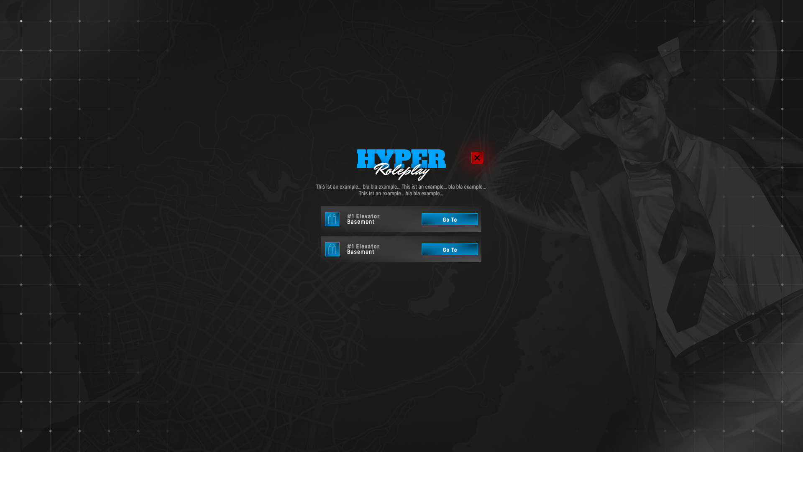

# If you find any issues, please submit a pull request.

## Features:
- An infinite number of lifts possible
- Multiple floors per elevator
- Teleport mit Fade In/Out
- Modern UI
- Player cannot move while teleporting
- No teleporting while the player is dead
- No teleporting if the vehicle is not allowed

## What can be added:
- Cooldown between floor changes to prevent spamming.
- Blip per elevator on the map (can be enabled in the config)
- Server-side distance check before teleporting as an anti-cheat measure (currently, usage is only logged, not validated)